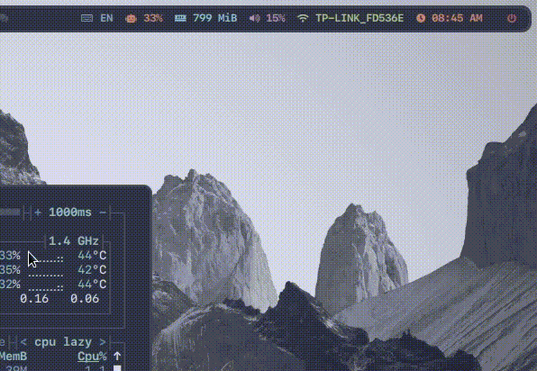

# Ibus module for polybar

- Trigger via polybar-msg



# Install
```bash
git clone https://github.com/tht2005/ibus-polybar-module.git

# copy all the contents to your polybar config folder
cp -R ibus-polybar-module/* ~/.config/polybar/scripts/
```

### First: Custom for yourself

- You need to define your ibus engine at ibus_toggle.sh and ibus.sh
  - Show list ibus engine available via command : `ibus list-engine`
  - Edit the ibus_conf.sh file.
    ```bash
    #!/bin/bash

    IBUS_SET_VARIABLES() {
	    IBUS_DATA_DELIMETER=';'
	    # Each line represent an ibus language
	    # "Language name (depend on you, for display and debug purpose);engine name;language icon file path"
	    IBUS_DATA=(
	      "VIE;Bamboo::Candy;/home/tomoshibi/.config/polybar/scripts/flags/vietnam.svg"
	      "ENG;BambooUs;/home/tomoshibi/.config/polybar/scripts/flags/226-united-states.svg"
	      "JAP;anthy;/home/tomoshibi/.config/polybar/scripts/flags/063-japan.svg"
	    )

	    # Grey label shown when ibus is off
	    IBUS_OFF_LABEL="%{F#666}off%{F-}"

	    # Notification when switch language
	    IBUS_NOTIFICATION=true
    }
    ```

Append to polybar.conf (or something simular like modules.conf)

```ini
[module/ibus]
type = custom/ipc
hook-0 = ~/.config/polybar/scripts/ibus.sh
; find any icon suitable
format-prefix = "  "
format-prefix-font = 2
format-prefix-foreground = ${color.blue}
format-prefix-background = ${color.background}
format-background = ${color.background}
format-foreground = ${color.blue}
click-left = ~/.config/polybar/scripts/ibus_toggle.sh &
click-right = ~/.config/polybar/scripts/ibus_toggle.sh &

[module/ibus-trigger]
type = custom/script
exec = polybar-msg hook ibus 1 &>/dev/null
interval = 0
tail = true
```

Add to bar

```ini
modules-left =
modules-center =
modules-right = ibus ibus-trigger
```

- Key binding to file ibus_toggle.sh if you want to use the shortcut.
